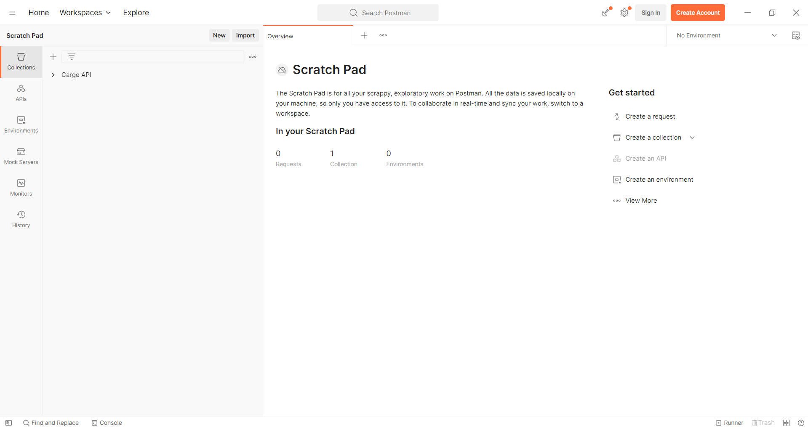
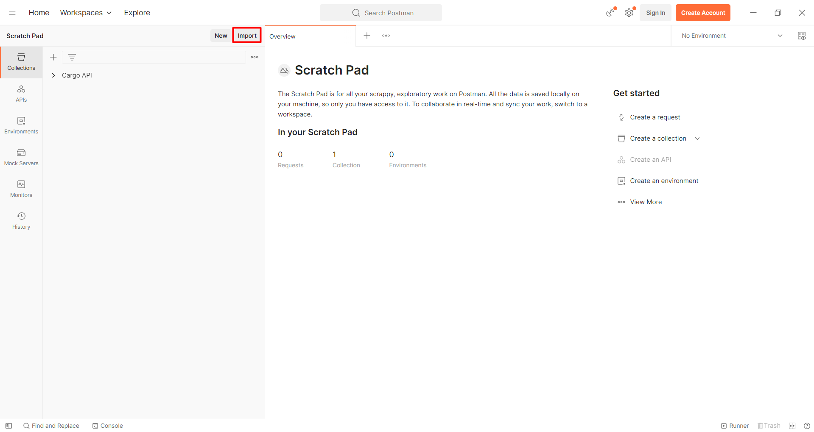
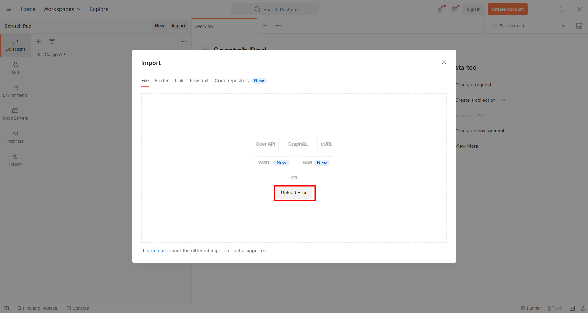
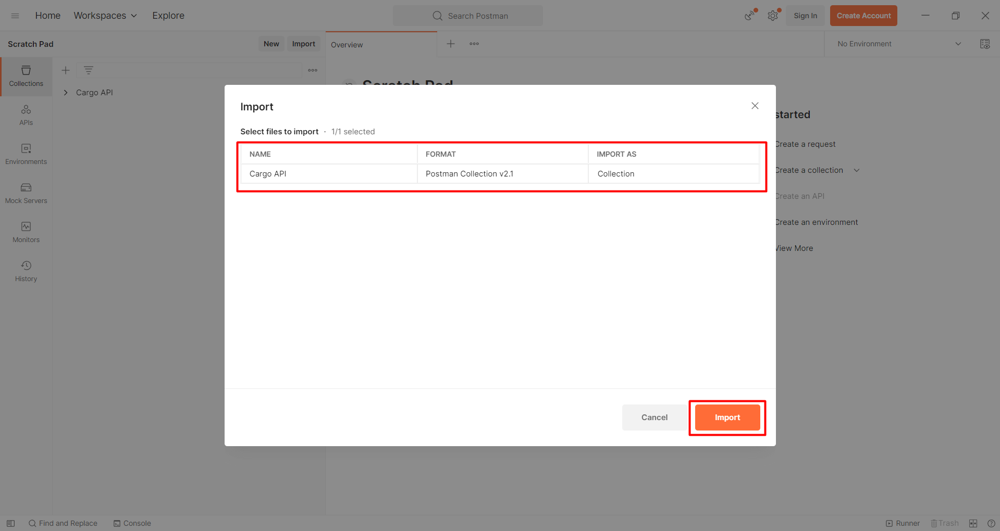
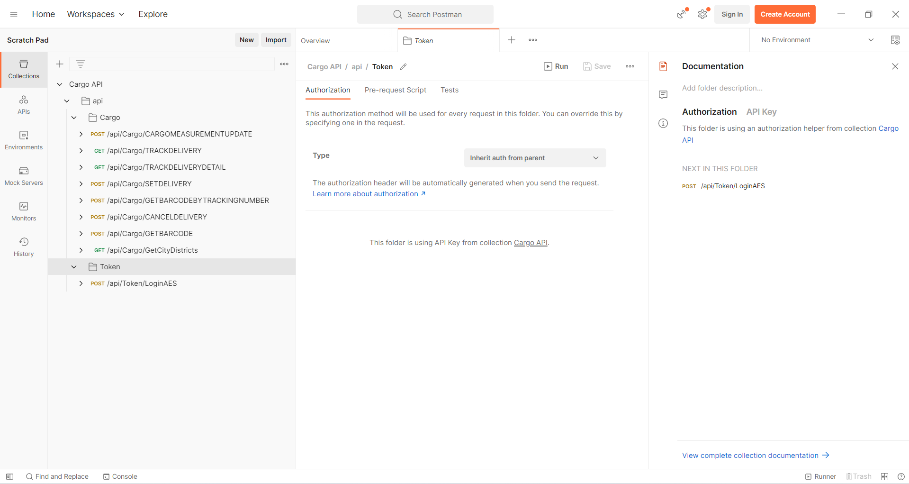

## Kolay Gelsin Kargo API Postman Collection

Base Endpoint : [https://bff.kolaygelsin.com/gateway](https://bff.kolaygelsin.com/gateway)

Teknik Destek / İletişim : [entegrasyon@kolaygelsin.com](mailto:entegrasyon@kolaygelsin.com)

Dokümantasyon : [https://klyglsn.github.io/web-service-doc/](https://klyglsn.github.io/web-service-doc/)

##

[Postman Collection Indir](Cargo_API.postman_collection.json)

"Cargo_API.postman_collection.json" dosyasını indirin ve aşağıdaki yönergeleri takip edin.

* Postman uygulamasını açın.

* Import butonuna basın.

* File sekmesinde yer alan Upload File butonuna basın.

* İndirdiğiniz "Cargo_API.postman_collection.json" dosyasını seçin.

* Collections bölümüne Cargo API eklenmiş olacak. Kendi bilgilerinizi kullanarak, endpoint leri kullanabilirsiniz.
