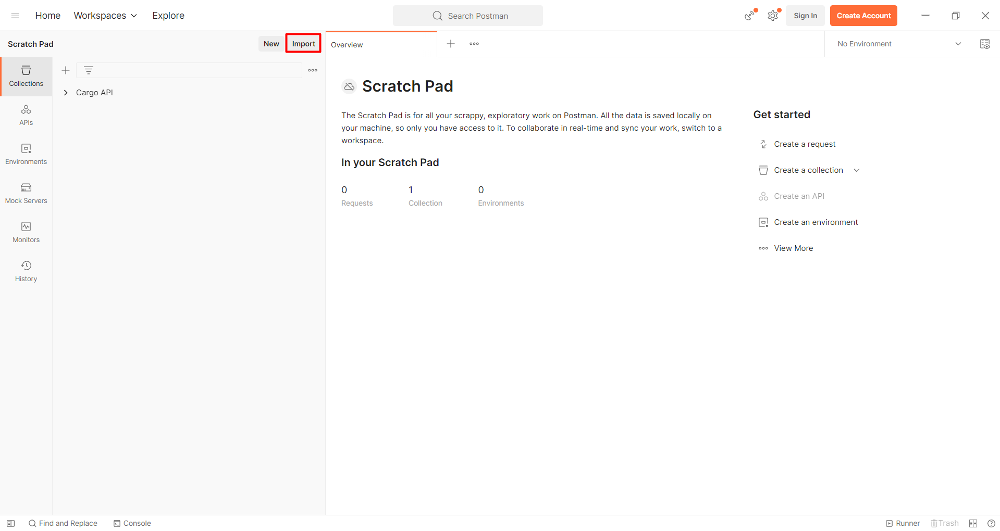
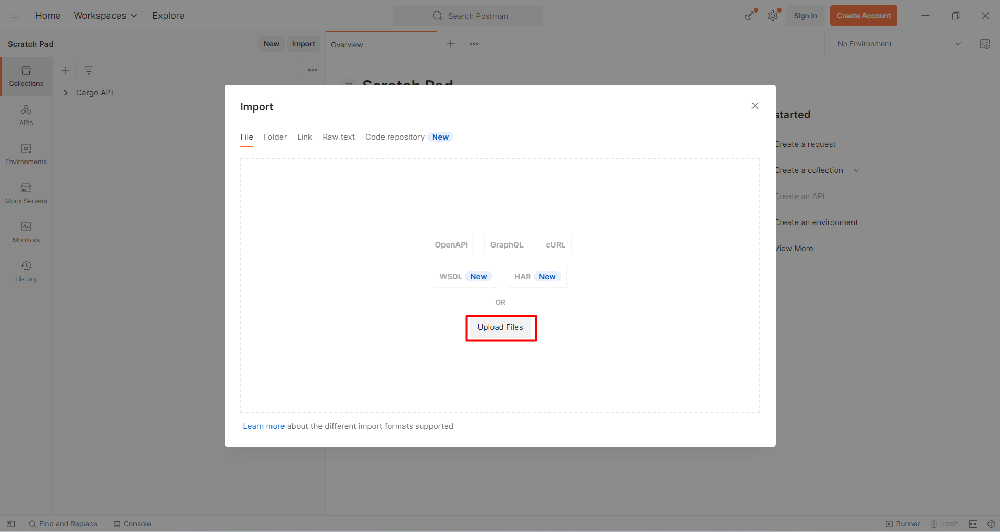

# Kolay Gelsin Kargo API
## Postman Collection

### Import

[Postman Dosyası Indir](Cargo_API.postman_collection.json)

"Cargo_API.postman_collection.json" dosyasını indirin ve Aşağıda ki yönergeleri takip edin.

* Postman Açın

* Import Butonuna Basın

* File Sekmesinde Upload File Butonuna basin

* Indirdiğiniz "Cargo_API.postman_collection.json" dosyasını seçin

* Collections bölümüne Cargo API eklenmiş olacak. Kendi bilgilerinizi kullanarak bu Endpoint leri kullanabilirsiniz.

